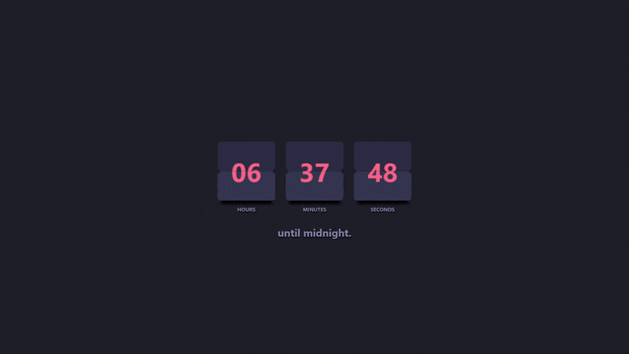

# ⏳ Flip Card Timer

A stylish animated countdown timer that displays **hours, minutes, and seconds** left until midnight — all built with **TypeScript**, **HTML**, and **CSS** using **Vite**.

Each time unit flips in a satisfying card animation, giving it a retro clock feel.

## 🔗 Live Demo

👉 [Check it out here](https://abdulqad33r.github.io/flip_card_timer/)

## ✨ Features

- Smooth flip-card animation for each time unit
- Automatically resets at midnight
- Fully responsive layout
- Built with clean vanilla TypeScript + Vite

## 🛠 Tech Stack

- TypeScript
- HTML & CSS
- Vite (for dev server and bundling)
